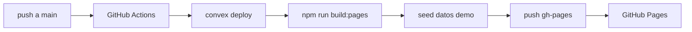

# Automatización (casi sin intervención manual)

La app puede configurarse y desplegarse **automáticamente** con GitHub Actions. Solo necesitas **una acción tuya** (login en Convex en el navegador, una sola vez).

---

## Lo que ya está automatizado

| Acción | Cómo |
|--------|------|
| Compilar la web para Pages | Workflow en cada push a `main` |
| Publicar en `gh-pages` | Workflow automático |
| Activar/configurar Pages (si tienes permisos) | Workflow intenta vía API |
| Desplegar Convex en la nube | Workflow con `CONVEX_DEPLOY_KEY` |
| Inyectar URL de Convex en el build | `convex deploy --cmd` (sin secret extra) |
| Cargar fincas de demostración | `seed:seed` tras cada deploy |

**URL de la app:** https://ghostspecialtycoffee-lab.github.io/APP-dieguito/

---

## Opción A — Un solo comando (recomendada)

En tu computador, con Node 18+ y [GitHub CLI](https://cli.github.com) (`gh auth login`):

```bash
git clone https://github.com/ghostspecialtycoffee-lab/APP-dieguito.git
cd APP-dieguito
npm run setup:once
```

**Qué hace:**
1. Configura GitHub Pages (rama `gh-pages`)
2. Abre Convex en el navegador **solo si** no tienes sesión (`npx convex login`)
3. Crea una deploy key y la guarda en GitHub como `CONVEX_DEPLOY_KEY`
4. Ejecuta el workflow de publicación
5. Verifica que la URL responde

**Después:** no vuelves a tocar nada. Cada `git push` a `main` actualiza todo.

---

## Opción B — Solo ver estado

```bash
npm run setup:status
```

Muestra si Pages, secrets y Convex están listos.

---

## Opción C — Python (más control)

```bash
python3 scripts/automate_setup.py          # estado
python3 scripts/automate_setup.py --full   # configurar todo
```

Si ya tienes la deploy key en el entorno:

```bash
export CONVEX_DEPLOY_KEY="tu-key"
python3 scripts/automate_setup.py --full
```

---

## Qué NO se puede automatizar sin ti

| Limitación | Por qué |
|------------|---------|
| Crear cuenta Convex | Requiere autorización en el navegador (OAuth) |
| Primera deploy key | Convex exige login humano una vez |
| Secrets en GitHub desde el agente en la nube | El token del agente no tiene permisos de admin |

**Una vez** que ejecutas `npm run setup:once`, el resto es 100 % automático.

---

## Secret necesario (solo uno)

| Secret | Obligatorio | Cómo se crea |
|--------|-------------|------------|
| `CONVEX_DEPLOY_KEY` | Sí (para datos en la nube) | `npm run setup:once` |

Ya **no** hace falta `VITE_CONVEX_URL` por separado: el workflow usa `convex deploy --cmd` y pasa la URL al build.

---

## Flujo automático (después del setup)



---

## Problemas

**Workflow sin Convex**  
→ Falta `CONVEX_DEPLOY_KEY`. Ejecuta `npm run setup:once`.

**`gh secret set` falla**  
→ Necesitas ser admin del repo. `gh auth login` con cuenta correcta.

**Pages 404**  
→ `npm run setup:once` o Settings → Pages → `gh-pages` / root.
